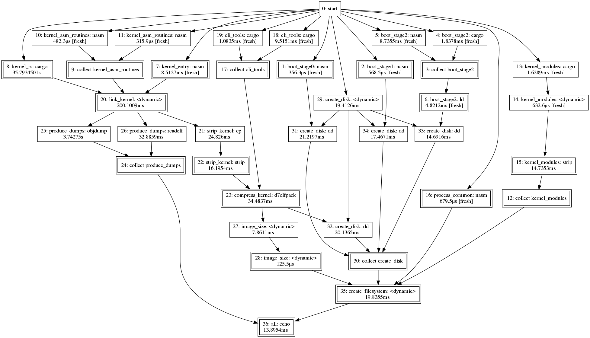

# Factory - a flexible parallel build system

* Configuration written in Python
* Runs build steps simultaneously
* Skips unnecessary commands



## Building

Latest Rust nightly is required.

Python 3.7 or newer, including `libpython3.X` and `libpython3.X-dev` on Linux.

```bash
PYTHON_SYS_EXECUTABLE=python3.7 cargo build
```
