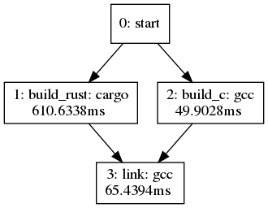

# Example: Calling Rust from C

Simple build script

```bash
cargo build --release
gcc -c src/example.c -o target/example_c.o
gcc target/example_c.o target/ debug/libexample.so -o target/example
```

The result can now be ran with `./target/example`.

However, see `Factory.toml` and `factory.py` for an example of a Factory build pipeline.
It is able to run the `cargo build` and the first `gcc` in parallel.
Also, if source files have not been modified, it will not recompile either part.


If you have graphviz installed, you can run `dot -Tpng target/dot.dot > out.png`.
Now you have file out.png that displays dependency graph and compilation times
for different steps of the pipeline. Here the parallelization is clearly visible:

